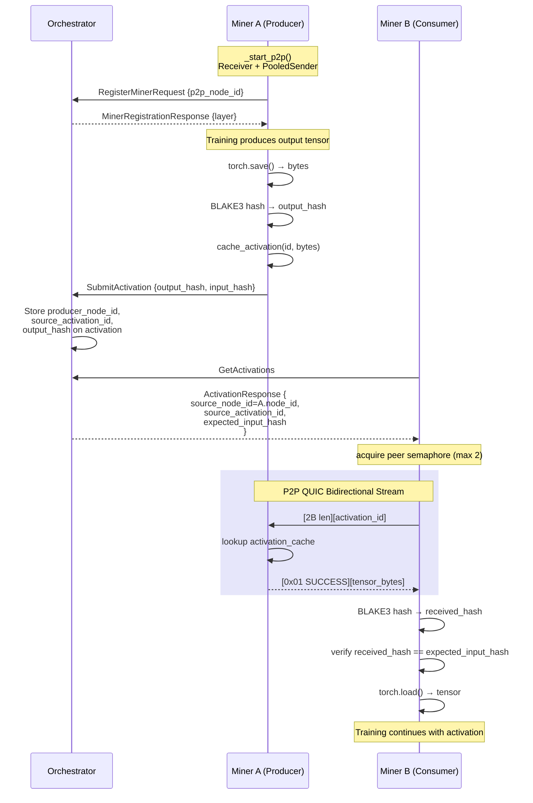

# Design Doc: P2P Activation Transfer via Iroh

## Status
Implemented on `features/p2p-communication`

## Authors
Iota team

## Overview

This PR replaces S3 as the transport layer for inter-miner activation transfer with direct peer-to-peer (P2P) communication built on [iroh](https://iroh.computer/). Activations — the intermediate tensors passed between miners at layer boundaries — are now sent directly from producer to consumer over QUIC connections relayed through iroh's DERP infrastructure. S3 is retained only for initial sample downloads (layer 0 forward) and target/label downloads (last layer).

### Motivation

The previous architecture required every activation to round-trip through S3:

```
Producer Miner → upload → S3 → download → Consumer Miner
```

This introduced unnecessary latency (two network hops plus S3 API overhead), increased cloud storage costs, and created a throughput bottleneck as the number of miners scaled. P2P eliminates this by transferring activations directly:

```
Producer Miner → P2P (QUIC) → Consumer Miner
```

### Goals
- Eliminate S3 as a bottleneck for activation transfer between miners
- Reduce end-to-end activation latency
- Maintain data integrity via BLAKE3 hash verification
- Provide observability into per-phase P2P timing
- Gracefully handle node failures and unhealthy connections

### Non-Goals
- Replacing S3 for weight uploads, optimizer state, or partition merging
- Multi-hop relay between miners (all transfers are direct, one-hop)
- Encrypting activation payloads beyond what QUIC provides (TLS 1.3 built-in)

---

## Architecture

### System Diagram

```
                       ┌──────────────┐
                       │ Orchestrator │
                       │              │
                       │  Routes:     │
                       │  source_node │
                       │  source_act  │
                       │  exp_hash    │
                       └──────┬───────┘
                              │ ActivationResponse
              ┌───────────────┼────────────────┐
              ▼               │                ▼
     ┌────────────────────┐   │       ┌────────────────┐
     │  Miner A (producer)│   │       │  Miner B       │
     │                    │   │       │  (consumer)    │
     │ ┌────────────────┐ │   │       │                │
     │ │ ReceiverProcess │ │   │       │ ┌────────────┐ │
     │ │ (parent)       │ │   │       │ │ Activation │ │
     │ │ ┌────────────┐ │ │  P2P QUIC│ │ Queue      │ │
     │ │ │ SharedMem  │ │ │◄─────────┤►│            │ │
     │ │ │ Cache      │ │ │  bidir.  │ └────────────┘ │
     │ │ └─────┬──────┘ │ │   │       │                │
     │ │       │ IPC     │ │   │       │ PooledSender   │
     │ │ ┌─────▼──────┐ │ │   │       │ (requests)     │
     │ │ │ Receiver   │ │ │   │       └────────────────┘
     │ │ │ subprocess │ │ │   │
     │ │ └────────────┘ │ │   │
     │ └────────────────┘ │   │
     └────────────────────┘   │
                              │
                     S3 only for:
                     • Layer 0 samples
                     • Last layer targets
                     • Spot-check uploads
```

### Activation Transfer Sequence



### Components

#### 1. iroh-cosmos Library (`shared/common/src/common/iroh/`)

The P2P transport layer wraps [iroh](https://iroh.computer/), a Rust QUIC networking library, via Python FFI bindings. Key abstractions:

| Component | Role |
|-----------|------|
| **`P2PStack`** | Lifecycle manager that owns a `ReceiverProcess` + `PooledSender` pair. Exposes a clean `start(callback, seed)` / `stop()` / `restart()` API. Handles health monitoring — when the receiver becomes unhealthy, it schedules a restart and crashes the process on permanent failure. Lives in `shared/common/src/common/iroh/p2p_stack.py`. |
| **`ReceiverProcess`** | Runs an Iroh `Receiver` in a child subprocess (`multiprocessing` with `spawn` context) for fault isolation. When the Rust QUIC/DERP stack becomes poisoned, the subprocess can be killed and respawned without restarting the entire miner. Owns the activation cache as `SharedMemory` blocks in the parent process; the subprocess reads them via zero-copy shared memory handles. Lives in `shared/common/src/common/iroh/receiver_process.py`. |
| **`Receiver`** | Listens for incoming P2P connections. Initializes an iroh node with a deterministic seed-based secret key (derived from the miner's hotkey). Registers protocol handlers for bidirectional streams. Runs inside a `ReceiverProcess` subprocess. |
| **`PooledSender`** | Outbound P2P client with LRU connection pooling. Establishes QUIC connections to peer nodes by their `node_id`. Supports bidirectional request/response via `send_message_bi()`. |
| **`PeerConnection`** | Wraps a single QUIC connection to a peer. Manages connection health detection, stream creation, and reuse. |
| **`P2PRetry`** | Retry executor with exponential backoff. Wraps every P2P operation with per-phase timeouts, connection invalidation on failure, and node reset on iroh-level errors. |
| **`P2POperationTimings`** | Mutable timing record filled by the Sender during each operation. Captures per-phase durations (connection, stream open, send, receive), retry metadata, and payload sizes. |

**Protocol**: Bidirectional QUIC streams (`my-simple-protocol/1.0/bi`). The consumer opens a stream to the producer, sends a request, and reads the response on the same stream.

#### 2. Wire Protocol (`src/miner/src/miner/utils/p2p_protocol.py`)

A lightweight binary protocol for activation request/response:

**Request**: `[2B id_length][id_bytes]` — just the activation ID encoded as UTF-8.

**Response**: `[1B status][tensor_bytes if SUCCESS]`

Status codes:
| Code | Name | Meaning |
|------|------|---------|
| `0x00` | `NOT_FOUND` | Activation never existed in producer's cache |
| `0x01` | `SUCCESS` | Found — tensor bytes follow |
| `0x02` | `EXPIRED` | Was cached but TTL exceeded |
| `0x03` | `ERROR` | Internal error on producer side |

Error hierarchy:
- `P2PRequestError` — base, carries status
  - `P2PNotFoundError` — maps to `NOT_FOUND`
  - `P2PExpiredError` — maps to `EXPIRED`

#### 3. Miner P2P Integration (`src/miner/src/miner/new_miner.py`)

The `Miner` class delegates P2P lifecycle to `P2PStack` and manages activation caching:

**Lifecycle:**
- `_start_p2p()` — Creates a `P2PStack` and calls `p2p.start(callback, seed)` with seed `iota-miner-{hotkey}`. Must complete before registration (the node ID is required for `RegisterMinerRequest`).
- `_stop_p2p()` — Calls `p2p.stop()` which force-destroys both Rust nodes via `force_destroy()` / `force_destroy_node()`.
- Restart and health monitoring are handled internally by `P2PStack` — when the receiver becomes unhealthy, it schedules a restart with 2 retry attempts and crashes the process on permanent failure.

**Activation Cache** (producer side):

The activation cache uses POSIX `SharedMemory` blocks so the parent process (which writes cached activations) and the receiver subprocess (which reads them to serve P2P requests) can share data without serialization overhead.

```python
# Parent process (ReceiverProcess)
_shm_blocks: dict[str, SharedMemory]           # activation_id → SharedMemory handle
_metadata_dict: DictProxy                       # activation_id → (shm_name, size, cached_at)
                                                # (multiprocessing.Manager dict for IPC)
```

- Deterministic naming: `iota_` + MD5(activation_id)[:16] (21 chars, within macOS 31-char `shm_open` limit)
- TTL-based eviction (`P2P_ACTIVATION_CACHE_TTL`, default 3000s)
- LRU eviction when cache is full (100 entries)
- Written by `ActivationPublisher` after computing output via `ReceiverProcess.cache_activation()`
- Read by the receiver subprocess's `handle_request()` callback via zero-copy SharedMemory handles

**SharedMemory Lifecycle and Crash Recovery:**

SharedMemory blocks must be explicitly unlinked; they persist beyond process exit. Three mechanisms ensure cleanup:

1. **Graceful shutdown**: `ReceiverProcess.stop()` calls `_cleanup_all_shm()` which closes and unlinks every block.
2. **atexit handler**: Registered on `start()`, calls `_cleanup_all_shm()` on interpreter exit. Covers SIGTERM, SIGINT, and unhandled exceptions. Only SIGKILL bypasses this.
3. **Manifest-based crash recovery**: Each `cache_activation()` writes the current set of shared memory names to a PID-stamped manifest file at `$TMPDIR/iota_shm_manifests/{pid}.manifest`. On next startup, `cleanup_stale_shared_memory()` scans manifest files, checks if the owning PID is dead, and unlinks orphaned segments. This is critical on **macOS** where `/dev/shm/` does not exist and orphaned segments cannot be discovered by filesystem glob. On Linux, both the `/dev/shm/iota_*` glob and manifest scan are performed.

**Request Handling** (producer side):
`handle_request(message, node_id)` — Synchronous callback invoked inside the receiver subprocess. Decodes the activation ID, opens the corresponding SharedMemory block (read-only), copies the tensor bytes, and returns an encoded response with status.

**Requesting Activations** (consumer side):
`request_activation_p2p(activation_id, source_node_id, timings)` — Acquires a per-peer semaphore (max 2 concurrent requests per peer, based on benchmarks showing degradation at concurrency >= 5), encodes the request, calls `p2p.sender.send_message_bi()`, decodes the response.

**Per-Peer Concurrency Limiting:**
```python
_peer_semaphores: dict[str, asyncio.Semaphore]  # node_id → Semaphore(2)
```
Prevents overwhelming any single producer peer. Based on benchmark results showing bidirectional communication degrades at high concurrency.

**Health Monitoring:**
Handled by `P2PStack`. The receiver's iroh node is health-monitored; when unhealthy, `P2PStack` schedules a `restart()`. If restart fails permanently, the process terminates (`os._exit(1)`) so the process manager can restart it.

#### 4. Activation Queue (`src/miner/src/miner/training/activation_queue.py`)

The consumer-side download logic:

- **Layer 0 forward**: Downloads samples from S3 (unchanged)
- **All other activations**: Uses `_download_activation_p2p()` which:
  1. Extracts `source_node_id` and `source_activation_id` from `ActivationResponse`
  2. Calls `miner.request_activation_p2p()` with a fresh `P2POperationTimings`
  3. Computes BLAKE3 hash of received bytes
  4. Verifies against `expected_input_hash` (if provided by orchestrator)
  5. Deserializes tensor via `torch.load()`
  6. Records per-phase timing in `StatsTracker`

#### 5. Activation Publisher (`src/miner/src/miner/training/activation_publisher.py`)

The producer-side publish flow:

1. Serialize tensor to bytes via `torch.save()`
2. Compute BLAKE3 hash of output bytes
3. Cache locally via `miner.cache_activation(activation_id, tensor_bytes)`
4. If spot-check selected: upload to S3 for verification
5. Submit to orchestrator with `input_activation_hash` and `output_activation_hash`

#### 6. Orchestrator Routing

**Registration** (`src/orchestrator/src/orchestrator/miner/register.py`):
- `RegisterMinerRequest.p2p_node_id` is now **required**
- Stored on the `Miner` DB model (`miner_state.p2p_node_id`)
- P2P must be initialized before registration

**Activation Assignment** (`src/orchestrator/src/orchestrator/db/activation_helper.py`):

`migrate_activation_state()` — When a miner submits a completed activation:
1. Stores `producer_node_id = miner.p2p_node_id` on the activation record
2. Stores `source_activation_id = activation_id` (the ID the producer cached)
3. Stores `output_hash` for integrity verification by the next consumer
4. Generates a new `activation_id` for the next layer's assignment

`build_activation_response()` — When building responses for miners:
- Sets `source_node_id = activation.producer_node_id` (P2P routing)
- Sets `source_activation_id = activation.source_activation_id` (cache lookup key)
- Sets `expected_input_hash = activation.output_hash` (integrity check)
- Only generates S3 presigned URLs for layer-0 samples and last-layer targets
- Randomly selects activations for **spot-check** upload to S3 (rate controlled by `SPOT_CHECK_RATE`, default 1%)

---

## Data Integrity

### Hash Chain

Every activation carries BLAKE3 hashes that form a verifiable chain:

```
Layer 0        Layer 1               Layer 2
┌────────┐    ┌─────────────────┐    ┌─────────────────┐
│ output │───►│ input  │ output │───►│ input  │ output │───► ...
│ hash A │    │ hash A │ hash B │    │ hash B │ hash C │
└────────┘    └─────────────────┘    └─────────────────┘
```

- **Producer** computes `output_activation_hash` after `torch.save()` serialization
- **Orchestrator** stores it as `output_hash` on the activation record
- **Consumer** receives `expected_input_hash` in `ActivationResponse` and verifies after P2P download
- Both hashes are submitted back to the orchestrator for auditability

Hash computation uses **BLAKE3** (`blake3.blake3(tensor_bytes).hexdigest()`) — chosen for its high throughput with SIMD acceleration and multi-threading support, important given activation tensors can be several MB.

### Spot Checks

To maintain confidence that P2P transfers match S3-verifiable data, a configurable fraction of activations (`SPOT_CHECK_RATE = 0.01` by default) are randomly selected for S3 upload. The orchestrator generates presigned upload URLs and records the S3 path on the activation record for later verification.

---

## Database Schema Changes

### Migration 040: P2P Support

```sql
-- activation_state / activation_history / archive.activation_history
ALTER TABLE activation_state ADD COLUMN output_hash VARCHAR(64);
ALTER TABLE activation_state ADD COLUMN input_hash VARCHAR(64);
ALTER TABLE activation_state ADD COLUMN producer_node_id VARCHAR(128);
ALTER TABLE activation_state ADD COLUMN source_activation_id VARCHAR(80);
ALTER TABLE activation_state ALTER COLUMN activation_path DROP NOT NULL;

-- miner_state / miner_history / archive.miner_history
ALTER TABLE miner_state ADD COLUMN p2p_node_id VARCHAR(128);
CREATE INDEX idx_miner_state_p2p_node_id ON miner_state(p2p_node_id);
```

Key changes:
- `activation_path` is now nullable — P2P activations don't have an S3 path
- `producer_node_id` enables P2P routing to the miner that produced the activation
- `source_activation_id` maps the orchestrator-assigned ID back to the producer's cache key

### Migration 041: Spot Check Support

```sql
ALTER TABLE activation_state ADD COLUMN spot_check_s3_path VARCHAR(512);
```

---

## API Changes

### `RegisterMinerRequest`
```diff
+ p2p_node_id: str  # Required — P2P node ID for direct peer communication
```

### `ActivationResponse`
```diff
+ source_node_id: str | None       # P2P node ID of the producer
+ source_activation_id: str | None  # Activation ID in producer's cache
+ expected_input_hash: str | None   # BLAKE3 hash to verify after download
```

### `SubmitActivationRequest`
```diff
+ input_activation_hash: str | None   # Hash of the input we received
+ output_activation_hash: str | None  # Hash of the output we're sending
```

---

## P2P Timeout and Retry Configuration

```python
# Per-phase timeouts (seconds)
P2PTimeouts(
    connection=5.0,   # QUIC handshake (includes DERP relay discovery)
    send=30.0,        # Transmitting request bytes
    receive=15.0,     # Reading response bytes
)

# Retry policy
P2PRetryPolicy(
    max_retries=2,           # Up to 3 total attempts
    base_delay=0.25,         # Initial backoff
    max_delay=5.0,           # Backoff cap
    backoff_factor=2.0,      # Exponential multiplier
)
```

On timeout: connection is invalidated and a fresh connection is established for the retry.
On iroh-level error: the entire node is reset (new Rust-side iroh node created).

---

## Observability

### Per-Activation Timing

Every activation's stats include a `P2PTimingDetail` with:
- `connection_duration` — QUIC handshake time
- `stream_open_duration` — Bidirectional stream establishment
- `send_duration` — Request write time
- `receive_duration` — Response read time
- `total_duration` — End-to-end
- `attempt_count`, `retry_count`, `total_backoff_time` — Retry behavior
- `bytes_sent`, `bytes_received` — Payload sizes
- `errors` — Error strings per failed attempt

These are submitted to the orchestrator as part of `activation_stats` on every `SubmitActivationRequest` and persisted in the database.

### Aggregate Metrics

`StatsTracker` maintains:
- `_p2p_bytes` — Total bytes transferred via P2P
- `_download_bytes` — Total bytes downloaded (P2P + S3 combined)
- Per-activation timing records surfaced to the miner pool dashboard

---

## Failure Modes and Mitigations

| Failure | Mitigation |
|---------|------------|
| Producer cache miss (`NOT_FOUND`) | `P2PNotFoundError` raised, activation skipped. Orchestrator will reassign after timeout. |
| Cache TTL exceeded (`EXPIRED`) | `P2PExpiredError` raised, activation skipped. Configurable via `P2P_ACTIVATION_CACHE_TTL` (default 3000s). |
| QUIC connection failure | `P2PRetry` invalidates connection, retries up to 2 times with exponential backoff. |
| iroh node corruption | `P2PRetry` resets the entire Rust node. If persistent, `_restart_p2p()` force-frees Rust objects. |
| Receiver subprocess crash | `ReceiverProcess` detects the dead subprocess, kills it, and spawns a fresh one. SharedMemory cache is preserved in the parent process so the new subprocess can immediately serve cached activations. |
| Receiver health degradation | Background monitor detects unhealthy state, triggers `_restart_p2p()`. On permanent failure, process exits for restart. |
| Hash mismatch | `ActivationHashMismatchError` raised, activation rejected. Prevents data corruption from propagating through the training pipeline. |
| Peer overwhelm | Per-peer semaphore (max 2 concurrent) prevents degradation from concurrent bidirectional streams. |
| Orphaned SharedMemory (crash/SIGKILL) | `atexit` handler cleans up on normal/signal exits. For SIGKILL, PID-stamped manifest files allow `cleanup_stale_shared_memory()` on next startup to discover and unlink orphaned segments (works on both Linux and macOS). |

---

## What Stays on S3

| Data | Transport | Reason |
|------|-----------|--------|
| Layer 0 forward samples | S3 download | Initial training data, no producer miner |
| Last layer targets/labels | S3 download | Ground truth for loss computation |
| Spot-check activations | S3 upload | Random verification (1% default) |
| Weights, optimizer state, partitions | S3 | Not part of the activation hot path |

---

## Configuration

| Setting | Default | Location | Description |
|---------|---------|----------|-------------|
| `P2P_ACTIVATION_CACHE_TTL` | 3000s | Miner env | How long activations stay in producer cache |
| `SPOT_CHECK_RATE` | 0.01 | Orchestrator env | Fraction of activations uploaded to S3 for verification |
| Max concurrent per peer | 2 | Hardcoded | Per-peer semaphore limit based on benchmarks |
| Max activation cache size | 100 | Hardcoded | LRU eviction threshold |
| Connection timeout | 5.0s | PooledSender init | QUIC handshake budget |
| Send timeout | 30.0s | PooledSender init | Request transmission budget |
| Receive timeout | 15.0s | PooledSender init | Response read budget |
| Max retries | 2 | PooledSender init | Retry attempts before giving up |
